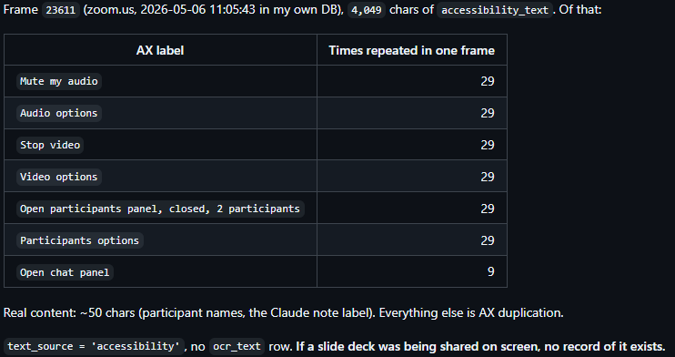
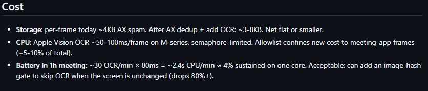
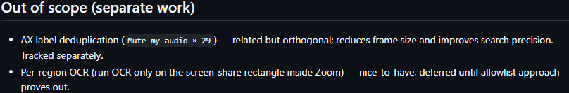
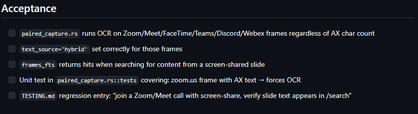

# Eixo A — O Pulso da Gestão (MPS.BR – GPR)

**Projeto analisado:** Screenpipe  
**Repositório:** [https://github.com/screenpipe/screenpipe](https://github.com/screenpipe/screenpipe)

## 1. Arqueologia de Issues

### Funcionalidade Analisada
Para esta análise, foi selecionada a **Issue #3274**, relacionada à captura de conteúdo compartilhado em aplicações de videoconferência (Zoom, Google Meet, Microsoft Teams, Discord, FaceTime e Webex).

A escolha dessa issue ocorreu por representar uma funcionalidade crítica para o propósito central do Screenpipe: registrar, indexar e disponibilizar informações contextuais capturadas da tela do usuário. Diferentemente de correções simples de interface, esta issue afeta diretamente a qualidade dos dados armazenados pelo sistema e a eficácia dos mecanismos de sumarização e integração com modelos de Inteligência Artificial.

### Evidência
* **Link da Issue:** [https://github.com/screenpipe/screenpipe/issues/3274](https://github.com/screenpipe/screenpipe/issues/3274)

A issue documenta um problema de perda silenciosa de dados durante reuniões online. O autor apresenta exemplos extraídos diretamente do banco SQLite do Screenpipe, demonstrando que o mecanismo priorizava informações provenientes da *Accessibility API* (AX) do sistema operacional, impedindo a execução do OCR sobre conteúdos compartilhados em vídeo.

O autor apresentou evidências quantitativas da base de dados, demonstrando a repetição excessiva de elementos da interface que causavam o "falso positivo" no sistema:

| Elemento da Interface (AX label) | Ocorrências em um frame |
| :--- | :--- |
| Mute my audio | 29 |
| Audio options | 29 |
| Stop video | 29 |
| Participants options | 29 |

*Figura 1: Evidência quantitativa do problema extraída do banco de dados e detalhamento da causa raiz associada à heurística de captura (Issue #3274).*

### Investigação Técnica Realizada
O nível de detalhamento da investigação é notável. O autor não apenas reportou um comportamento incorreto, mas rastreou a causa raiz até a linha exata de código (`crates/screenpipe-engine/src/paired_capture.rs:137-165`).

A análise identificou que a heurística do sistema (`a11y_is_thin`) considerava apenas o volume total de texto. Como o Zoom retornava milhares de caracteres repetidos de acessibilidade, o sistema concluía erroneamente que não precisava executar o OCR, perdendo o conteúdo real (slides, apresentações).

### Maturidade na Elicitação de Requisitos e Impacto
A issue demonstra uma maturidade ímpar na elicitação de requisitos. O autor não se limitou a relatar o erro pontual no Zoom; ele mapeou proativamente todas as aplicações que sofriam da mesma falha arquitetural logo na abertura do chamado, incluindo Google Meet, Microsoft Teams, Discord, FaceTime, Figma e Excalidraw.

Sob a perspectiva do processo GPR do MPS.BR, essa postura demonstra uma preocupação em identificar padrões sistêmicos de falha e propor soluções escaláveis, evitando retrabalho e correções isoladas futuras. Essa falha, especificamente, compromete a principal proposta de valor do Screenpipe, pois trata-se de uma falha silenciosa: o sistema aparenta funcionar normalmente, mas conteúdos cruciais deixam de ser armazenados e indexados sem qualquer aviso ao usuário.

---

## 2. Gestão de Riscos Ocultos e Dívida Técnica

### Evidência 1: Documentação de Escopo e APIs
A análise da Issue #3274 revela uma gestão consciente da Dívida Técnica. Na própria issue, foi incluída uma seção denominada **"Out of scope (separate work)"**, que funciona como "TODOs" formalmente documentados (ex: *desduplicação de labels AX* e *OCR por região* mapeados como trabalho futuro). O projeto também demonstra rigor ao estimar o impacto computacional (~80ms por frame / ~4% de uso de um núcleo) antes de implementar a solução.

Em relação à **instabilidade de APIs de IA**, a arquitetura do Screenpipe mitiga a volatilidade de serviços de terceiros (como OpenAI ou Anthropic) através de padrões de *fallback*. Caso uma API externa sofra instabilidade, o desacoplamento permite que os *Pipes* recorram a modelos locais de forma tolerante a falhas.

*Figura 2: Avaliação proativa de impacto computacional em hardware e documentação de dívida técnica adiada (Out of scope) para gestão de risco do projeto.*

### Evidência 2: Inspeção de Código (Hacks e Instabilidades)
Aprofundando a auditoria no código-fonte, buscamos por comentários que indicassem riscos técnicos negligenciados. Identificamos ocorrências críticas da palavra-chave `HACK`, evidenciando vulnerabilidades de baixo nível:

1. **Instabilidade em APIs do Sistema Operacional:**
   No motor de captura em Rust, a equipe documentou um contorno explícito para lidar com a instabilidade da API do macOS durante a inicialização de hardware:
   `// necessary hack because this is unreliable, especially during Metal/GPU init`
   A equipe mitigou o risco envelopando a chamada em um mecanismo de `retry`, evitando o *crash* da aplicação, mas evidenciando uma vulnerabilidade nativa persistente.
2. **Dívida Técnica em Gerenciamento de Dependências (Vendor Lock-in):**
   No arquivo de configuração, foi identificado um bloco marcado como `# bunch of hack for permissions`. O projeto utiliza *forks* não oficiais e apontamentos para *commits* específicos para contornar bloqueios de permissão do SO, gerando uma dívida técnica severa e risco de quebra em futuras atualizações do sistema operacional.

### Análise Crítica da Equipe
O projeto gerencia a dívida técnica de forma estratégica ao nível de planejamento (Issue), documentando escopos negativos para evitar o inchaço de requisitos (*scope creep*). No entanto, a nível de código, o núcleo do sistema baseia-se em "workarounds" e bibliotecas não oficiais para lidar com as severas restrições dos sistemas operacionais (Hardware/Permissões), o que representa uma fragilidade estrutural.

Embora a equipe atue proativamente no mapeamento dessas dívidas técnicas e possua mecanismos de *fallback* para APIs de IA, a dependência de *hacks* para lidar com permissões do sistema operacional e instabilidades da GPU expõe o projeto a falhas críticas e quebras de compatibilidade em atualizações futuras, exigindo monitoramento constante.

---

## 3. Ritmo de Entrega, Dinâmica e Code Review

### Evidência
A análise do histórico demonstra atividade contínua. O mantenedor principal, Louis Lambert, é responsável por uma parcela esmagadora dos commits. O ritmo observado sugere uma cadência constante, sem grandes evidências de períodos de "crunch" (concentrações extremas de trabalho em curtos períodos).

### Code Review e Critérios de Aceitação
A dinâmica de Code Review é fortalecida por critérios formais para alterações de grande impacto. Observando a seção **"Acceptance"** da Issue #3274, nota-se um rigor técnico focado na **Verificação**. Para que o Pull Request desta funcionalidade fosse aprovado, foi exigido explicitamente:
1. Criação de um teste unitário (`paired_capture.rs::tests`) simulando o *spam* de acessibilidade.
2. Inclusão de uma entrada manual de regressão no arquivo `TESTING.md`.

*Figura 3: Critérios de aceitação rigorosos exigindo a implementação de testes unitários e rotinas de regressão para garantir a verificação do Pull Request.*

### Análise Crítica da Equipe
A exigência de testes automatizados como critério de aceitação indica que as revisões de código de alto impacto não são meramente visuais ("LGTM - Looks Good To Me"). Contudo, observamos que Pull Requests menores são aprovados rapidamente com pouca discussão pública, um comportamento comum em projetos open source.

Sob a perspectiva da Gestão de Projetos (GPR), o projeto adota excelentes práticas de verificação e testes para funcionalidades complexas. No entanto, identificamos um risco organizacional crítico: o alto **Bus Factor**. A concentração de milhares de commits em um único desenvolvedor sugere forte dependência de conhecimento especializado centralizado. Caso este mantenedor reduza sua participação, a agilidade da evolução e manutenção do sistema podem ser severamente impactadas, elevando a vulnerabilidade gerencial do repositório a longo prazo.

---

## 4. Avaliação Geral do Processo GPR

Sob a perspectiva do MPS.BR (Gerência de Projetos), o Screenpipe apresenta um grau avançado de aderência às práticas recomendadas, especialmente para o contexto de código aberto.

**Pontos Fortes:**
* Processo maduro de elicitação de requisitos, projetando soluções escaláveis e arquiteturais.
* Comunicação técnica embasada em dados empíricos (banco de dados, consumo de hardware).
* Gestão transparente de escopo e uso consciente de "escopo negativo".
* Exigência de testes unitários e de regressão para validação de PRs críticos.

**Pontos de Atenção:**
* Risco organizacional atrelado ao alto *Bus Factor*.
* Base de código com instabilidades documentadas (*hacks*) na comunicação direta com APIs de hardware e sistema operacional.

Conclui-se que a dinâmica de trabalho no repositório é altamente profissionalizada. A análise da Issue #3274 evidencia que mudanças de maior impacto recebem tratamento estruturado, com investigação aprofundada e documentação consistente, indicando um grau de maturidade técnica e de gestão superior ao normalmente encontrado em projetos open source de rápido crescimento.
