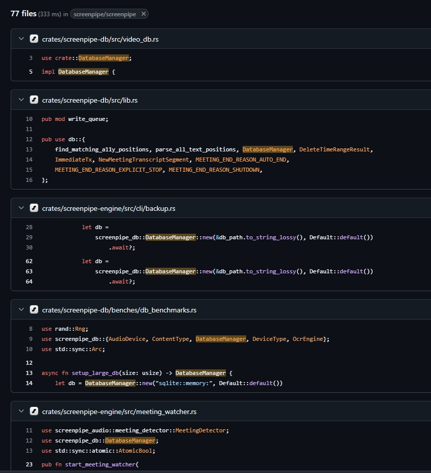
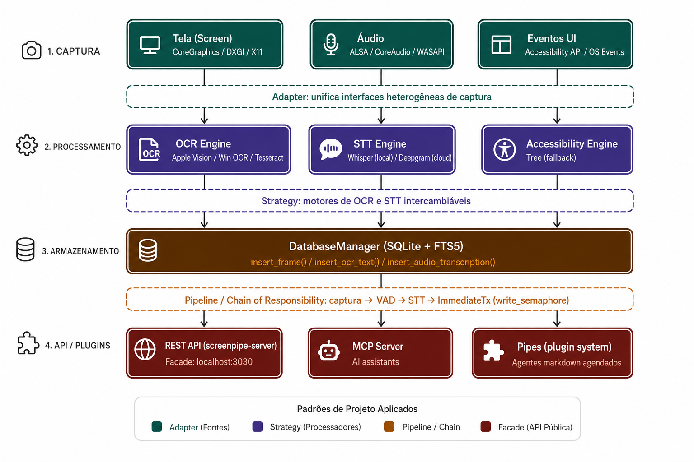

## C1. Padrões Criacionais
### Evidência 

Fonte:github(https://github.com/search?q=repo%3Ascreenpipe%2Fscreenpipe%20%20DatabaseManager&type=code)

Durante a análise arquitetural do projeto screenpipe, foi identificado um componente centralizado responsável pelas operações de armazenamento e indexação de dados:
DatabaseManager (SQLite + FTS5)
O componente concentra funções como:
insert_frame()
insert_ocr_text()
insert_audio_transcription()
Também foi observada a existência de um fluxo centralizado de persistência utilizado por diferentes módulos do sistema.

### Diagnóstico 
Não foi possível confirmar a implementação explícita do padrão Singleton no código-fonte, porém a arquitetura apresenta características compatíveis com esse padrão devido à centralização das operações de persistência em um único componente, uma vez que o gerenciamento do banco de dados aparenta ocorrer de forma centralizada, evitando múltiplas conexões desnecessárias ao mecanismo de armazenamento.
Essa abordagem reduz a redundância operacional e melhora o controle sobre acesso aos dados, especialmente em um sistema que executa captura contínua de tela, OCR e transcrição de áudio simultaneamente.
Além disso, a arquitetura também sugere utilização parcial do padrão Factory Method na criação de componentes de processamento, permitindo inicialização dinâmica de serviços dependendo do ambiente ou plataforma utilizada.

### Classificação de Risco
Risco: Médio
Embora a centralização do acesso ao banco favoreça a consistência, a ausência explícita de mecanismos robustos de concorrência e gerenciamento de estado pode gerar gargalos ou dificuldades de escalabilidade em cenários de alta carga.

### Recomendação
Recomenda-se formalizar a criação de conexões e serviços críticos utilizando padrões criacionais explícitos, reduzindo acoplamento e melhorando controle do ciclo de vida dos componentes.

## C2. Padrões Estruturais
### Evidência

Fonte: claude
O projeto trabalha com múltiplas fontes heterogêneas de captura:
Tela (Screen)
Áudio
Eventos UI …
Essas entradas passam por mecanismos distintos de processamento, incluindo OCR, STT e acessibilidade.
Foi identificado o seguinte fluxo conceitual:
- CaptureAdapter
-  ├── ScreenCaptureAdapter
-  ├── AudioCaptureAdapter
-  ├── EventAdapter

### Diagnóstico
O sistema demonstra forte aderência conceitual ao padrão Adapter.
Esse padrão permite padronizar diferentes mecanismos de captura sob uma interface comum, reduzindo a dependência direta de APIs específicas do sistema operacional.
A utilização de adaptadores favorece o desacoplamento arquitetural, a manutenção, a portabilidade e a substituição futura de tecnologias.
Além disso, a existência de APIs públicas e componentes externos sugere características compatíveis com o padrão Facade, no qual um componente simplifica o acesso às funcionalidades internas do sistema.

### Classificação de Risco
Risco: Baixo
A estratégia reduz o acoplamento excessivo e melhora a extensibilidade da arquitetura.

### Recomendação
Sugere-se consolidar explicitamente interfaces comuns para captura e processamento, formalizando contratos arquiteturais entre os módulos.

## C3. Padrões Comportamentais
### Evidência
Foi identificado um fluxo contínuo de processamento no sistema:
Captura → OCR/STT → Processamento → Banco → API
Também foram observados múltiplos motores de OCR e STT:
Apple Vision
Tesseract
Whisper
Deepgram

### Diagnóstico
O fluxo identificado apresenta forte similaridade com o padrão Pipeline, no qual os dados percorrem etapas sequenciais de transformação até a geração do resultado final.
Além disso, o comportamento do sistema também apresenta características do padrão Chain of Responsibility, especialmente pela propagação sequencial entre módulos de captura, transcrição e indexação.
Já a existência de múltiplos motores de OCR e STT sugere aderência conceitual ao padrão Strategy, permitindo utilização de algoritmos intercambiáveis dependendo da plataforma ou necessidade operacional.
Exemplo conceitual:
OCRStrategy
 ├── AppleVisionOCR
 ├── TesseractOCR
 ├── CloudOCR

### Classificação de Risco
Risco: Médio
A ausência explícita de abstrações formais entre etapas do pipeline pode gerar acoplamento excessivo e dificultar a substituição futura de componentes.
Também foi identificado possível risco de vendor lock-in relacionado aos provedores de IA e mecanismos de processamento utilizados pelo sistema.

###Recomendação
Recomenda-se introdução explícita de interfaces abstratas e aplicação formal dos padrões Strategy e Adapter para desacoplar provedores externos da lógica principal da aplicação.
Essa abordagem reduziria a dependência tecnológica e facilitaria a manutenção futura.

## Desfecho do Eixo:
A análise do projeto permitiu identificar forte aderência conceitual a diversos padrões clássicos GoF e arquiteturas modernas de software, especialmente Adapter, Strategy, Facade e Pipeline.
O sistema demonstra preocupação com modularidade e extensibilidade, porém ainda apresenta oportunidades importantes de melhoria relacionadas à formalização arquitetural e redução de acoplamento.
A principal preocupação identificada foi o risco de vendor lock-in e dependência excessiva de implementações específicas de IA, o que pode dificultar a evolução futura do sistema caso não sejam adotadas camadas adicionais de abstração.

## Autor: Pedro Miguel Castro França
